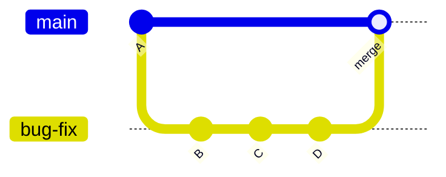
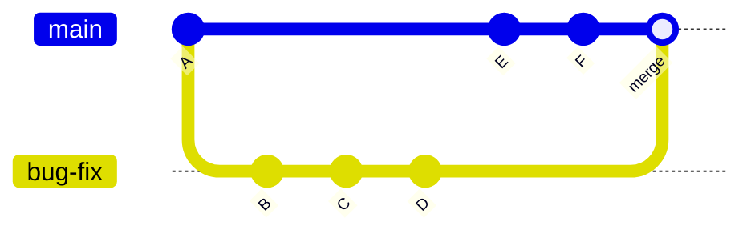

# Git Reference Guide

## Basic Commands

```bash
git --version
git status
git config --global user.email "khanzabiullah55@gmail.com"  # To change, use same command to edit/overwrite
git config --global user.name "Zabiullah Khan"
git config --list
```

---

## Creating a Repository

**Step-by-step process:**

1. `git status`
2. `git init` - You can now see the `.git` folder using `ls -la`
3. `git add <file1> <file2>...` or `git add .` - To add all files in the folder
4. `git rm --cached <file>...` - To unstage changes
5. `git commit -m "your message"`
6. `git log`
7. Add `.gitignore` file for files to be ignored like `.env`, `.vscode`, `node_modules`, etc.

---

## Configuration

### Change the Code Editor

```bash
git config --global core.editor "code --wait"
```

---

## Git Ignore

- A file named `.gitignore` where you list all files you want ignored during commit or push
- You can find gitignore file generators online (e.g., for VS Code)

---

## Git Keep

- A file named `.gitkeep` is used to keep **empty** folders in your repo
- Place `.gitkeep` file inside the empty folder
- Git does not track empty folders by default

---

## Workflow Overview

**MAJOR STEPS: Write → Add → Commit**

```
git init → Working Directory → git add → Staging Area → git commit → Repository → git push → GitHub
```

---

## Branching

### Creating a New Branch

```bash
git branch                    # List all branches
git branch bug-fix           # Create new branch called 'bug-fix'
git switch bug-fix           # Switch to 'bug-fix' branch
git log                      # Show commit history
git switch main              # Switch to 'main' branch
git switch -c dark-mode      # Create and switch to 'dark-mode' branch
git checkout orange-mode     # Switch to 'orange-mode' branch
```

**Command Explanations:**

- **git branch** - Lists all branches in the current repository
- **git branch bug-fix** - Creates a new branch called `bug-fix`
- **git switch bug-fix** - Switches to `bug-fix` branch
- **git log** - Shows the commit history for the current branch
- **git switch main** - Switches to `main` branch
- **git switch -c dark-mode** - Creates a new branch named `dark-mode` (the `-c` flag creates a new branch)
- **git checkout orange-mode** - Switches to the `orange-mode` branch

### Rename a Branch

```bash
git branch -m <old-branch-name> <new-branch-name>
```

### Delete a Branch

```bash
git branch -d <branch-name>
```

### Checkout a Branch

```bash
git checkout <branch-name>
```

---

## Merging Branches

In Git, there are **two types of merges**:

1. **Fast-Forward Merges** (if branches have not diverged)
2. **3-Way Merges** (if branches have diverged)

### Fast-Forward Merge

**Diagram:**
```
main:         o----o------------------------------o (merge)
                    \                            /
                     \                          /
                      \                        /
bug-fix:               o----------o----------o
```

**Mermaid Diagram:**


**Commands:**

```bash
git checkout main       # Switch to the 'main' branch
git merge bug-fix       # Merge the 'bug-fix' branch into 'main'
```

### 3-Way Merge

**Diagram:**
```
main:         o----o----o----o--------------------o (merge)
                    \                            /
                     \                          /
                      \                        /
bug-fix:               o----------o----------o
```

**Mermaid Diagram:**


**Commands:**

```bash
git checkout main       # Switch to the 'main' branch
git merge bug-fix       # Merge the 'bug-fix' branch into 'main'
```

---

## Summary

This guide covers the essential Git commands for:
- Basic configuration
- Repository creation
- Branch management
- Merging strategies

For more information, visit the [official Git documentation](https://git-scm.com/doc).
